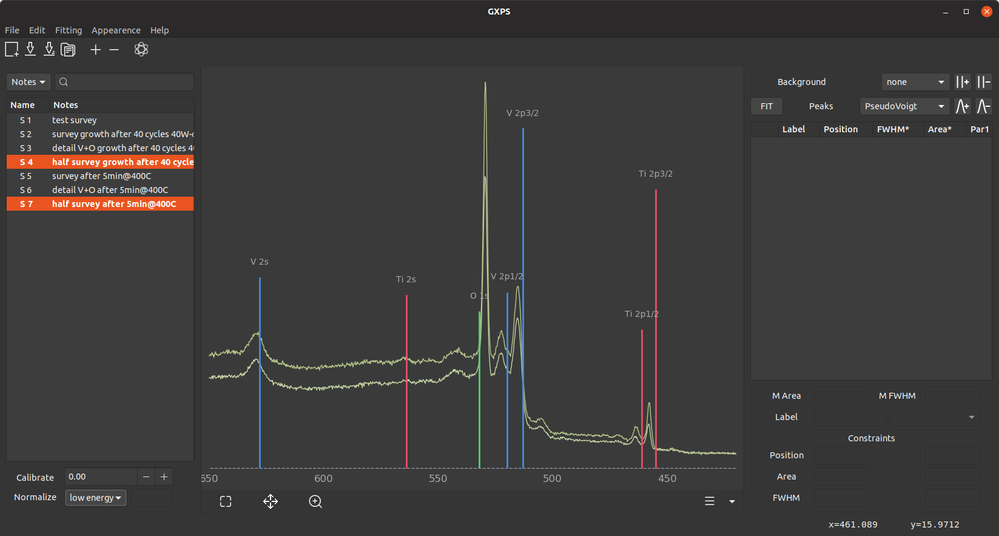
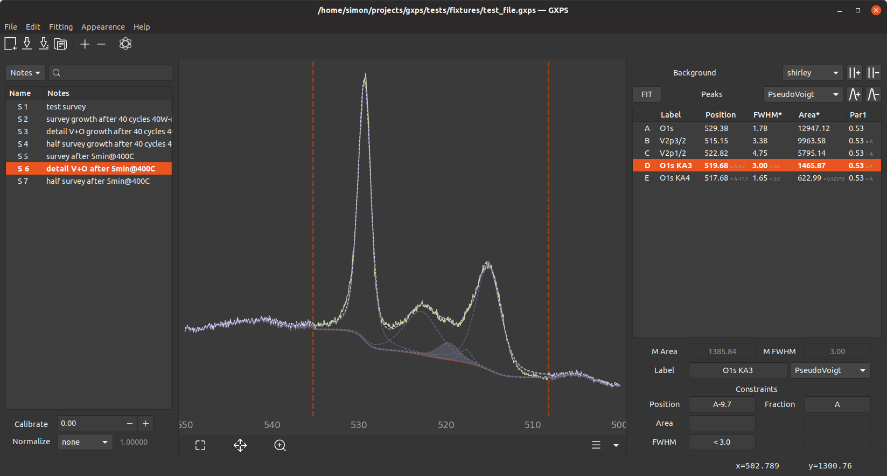

<p align="center">

</p>

# GXPS

*This project is still under development. Don't expect everything to work. If you encounter any bugs, please report them to me and include a logfile (On Linux: `~/.cache/gxps/logs`, on Windows: `C:\Users\$USER\AppData\Local\gxps\logs`).*

GXPS is a tool for visualizing and fitting X-ray photoelectron spectroscopy (XPS) data (although it may be possible to support also other kinds of spectroscopy data). For the fit, a variety of peak and background models are or will be implemented. Fit parameters can be constrained easily.

## Installation
### Ubuntu (or other Linux distros)

GTK needs to be version `>=3.14`. If you don't already have it installed, install python (`>=3.5`) and pip as well as libffi6 and python-gi through your package manager:

```shell
$ sudo apt install python3 pip3 libffi6 python3-gi libgirepository1.0-dev gir1.2-gtk-3.0 python3-gi-cairo libcairo2-dev python3-cairo-dev
```

(I don't know if you really need all of those dependencies)

GXPS is available via pip (don't use sudo!):

```shell
$ python3 -m pip install gxps
```

Update like this:

```shell
$ python3 -m pip install --no-deps --force-reinstall --upgade gxps
```

The pip installation puts a `.desktop` file into the `$HOME/.local/share/applications` directory, so it should appear as a normal installed application. You can also call it via `$ gxps`.

### Windows

**Caveat**: *The Windows .exe version is most likely outdated because I don't build it for every update.*

For running from source, please refer to [these instructions](build_win/README.md). The more convenient method, however, is just running the pre-built `.exe` that you can find [here](https://github.com/schachmett/gxps/releases/latest). Just download the appropriate `.zip` file and extract it. Inside is an executable that runs the program. GXPS creates a folder in `C:\Users\$USER\AppData\gxps` for log files and configuration files.

I plan on making a standalone `.exe` without the big folder around it and also on maybe making an installer later. Please note that GXPS seems to be significantly slower in Windows. Also, the builds are only tested in Windows 10 and I have no idea if it runs on older versions. Also, GXPS is quite ugly on Windows. I will at least try and make icons that work in a non-dark mode.

### OS X

It seems to be possible to run GXPS on a Mac but I don't know how.

## Usage

### Importing and visualizing spectra

For now, only files from the Omicron EIS software can be parsed. If you have another file format, please provide me with an example and I can write a parser for that. Or write one yourself in the [gxps.io module](gxps/io.py). Spectra can be imported via the Edit menu or the "Plus" button. They can be removed again by making them active and clicking the "Minus button".

On the left, the parsed spectra are listed. Through a right click, you can edit metadata and show the selected spectra in the spot (make them "active"). A double click on a spectrum also makes it active. Active spectra are displayed **bold**.

Below the table, you can user the "calibrate" buttons to shift the active spectra's energy axis (e.g. to compensate for charging). You can normalize them using different methods. 

The "Atom" symbol in the top bar allows you to display the core levels and Auger peaks of selected elements in the plot like shown in the following picture:



### Fitting

The panel on the right manages the spectrum fitting. It is possible to fit multiple spectra at once, however I recommend to have only one spectrum active during fitting.

##### Regions

Through the "∥+" symbol, regions are defined in which the chosen background subtraction algorithm is applied. You have to click and drag to draw the region. The "∥-" symbol is for deleting these regions (click the region). Next to those buttons, you can select which kind of background you want to subtract in that region.

##### Peaks

Below the Background buttons, new Peaks can be added via "Λ+" and then clicking in the plot and dragging a wedge shape. The dropdown menu next to that the model that new peaks will adopt (Standard should be PseudoVoigt). The peaks are displayed as faint broken lines and the peak that is selected at the moment is filled out in the plot. The sum of all peaks is shown as a thicker broken line. This sum of peaks is fitted to the actual data when you click the "FIT" button. To a delete peak, you need to click the "Λ-" button while that peak is selected.



##### Constaints

Below the list of peaks there are two fields for measured area `M Area` and measured FWHM `M FWHM`. These are necessary because for some peak models, the "real" area will be infinite (e.g. Doniach Sunjic). **WARNING**: These measured parameters are **not** correct right now.

Below the list of peaks are some buttons to constrain the parameters of the selcted peak. This can be done in three ways:

* Type a value and hit enter. This fixes the parameter to that value.
* Type boundaries like `< 530` or `>515 <517.3`.
* Type a simple formula like `A*5` or `B + 1.5` where `A` and `B` refer to another peak (e.g. if you are editing D's area, `A` refers to A's area). The unique letter of each peak is shown in the first column of the peak table.

Typical applications of this are: 

* You know the energy difference of two peaks because of their oxidation state and you want their position to stay at this fixed difference.
* You know the intensity relationships of two peaks and your model should reflect that. For example, A 2p<sub>3/2</sub> peak has two times the area of its corresponding 2p<sub>1/2</sub> peak.
* You want to constrain the width of a peak so the fit does not make it unreasonably wide
* You want to keep the `Fraction` of PseudoVoigt peaks (the ratio of Gaussian to Lorentzian shape) in a reasonable range.

Position, Area and FWHM are valid parameters for each peak model. However, the values on the right (e.g. Fraction) depend on the peak model.
You can also change the peak label and its model.


### Exporting data

Through "File" → "Export as txt..." and "Export as image..." you can export your data to useful file formats. Image exporting will include some features for making nice plots. For now, however, the dialog does nothing besides saving an image in the default design (all the buttons are not working here).

Saving and opening a project is also possible in the "File" menu.


## Peak models

##### PseudoVoigt

At the moment, this is the only shape that is reasonably stable. With the other models, you might run into some bugs. For this model, you also get the correct area and fwhm without needing the buggy `M Area` and `M FWHM` fields. The PseudoVoig model is very similar to the one used in [the nice `lmfit` module](https://lmfit.github.io/lmfit-py/builtin_models.html#pseudovoigtmodel). `Fraction` describes the Parameter they call alpha with

PsuedoVoigt = (1-`Fraction`) * Gaussian + `Fraction` * Lorentzian

##### Voigt

This is the real [Voigt model](https://en.wikipedia.org/wiki/Voigt_profile) which is a convolution of a Gaussian and a Lorentzian. I want to implement it in a way so that you can constrain either the Gaussian width or the Lorentzian width individually, but so far I did not have the time yet.

##### DoniachSunjic

Used for asymmetric peaks. See for example [here](http://www.casaxps.com/help_manual/line_shapes.htm), although my implementation uses the real Voigt model instead of the Gaussian-Lorentzian product. Use with caution as the `position` parameter does not necessarily reflect the position of highest intensity. Also, the width paremeter is not the real FWHM. You may encounter bugs for some parameter combinations.

##### A lot more

is not yet implemented.


## Building

### PyPI

Uploading a new version of GXPS to the PyPI works as follows:

```shell
python3 setup.py sdist bdist_wheel
python3 -m twine upload dist/*
```

### Windows

Please refer to [this manual](build_win/README.md).